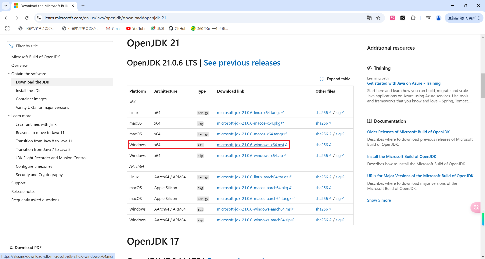
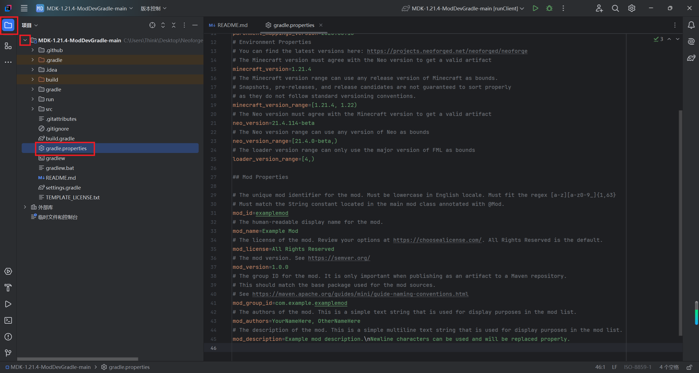

# 开始制作模组&环境配置

建议熟悉Java编程语言（花几个小时在网上学习了解一下也可以）

## 下载JDK和IntelliJ IDEA

下载[JDK21](https://learn.microsoft.com/en-us/java/openjdk/download#openjdk-21)，按正常步骤安装就可以了。

下载[IntelliJ IDEA](https://www.jetbrains.com/idea/download/?section=windows)，建议下载图中的社区版，因为它免费，如果你想选专业版也可以。

## 下载MDK

点击[链接](https://github.com/NeoForgeMDKs/MDK-1.21.4-ModDevGradle)，将仓库克隆到本地（若链接打不开或下载速度极慢，文章下方[疑难解答](#1Github链接打不开或下载速度极慢)会给出解决方法）

点击【Code】，【Download Zip】，仓库会下载到本地。然后将压缩包解压缩。

## 用IDEA打开文件

用IDEA打开【MDK-1.21.4-ModDevGradle-main】文件，等待构建完成，可能需要一段时间。点击图中标出的【构建按钮】，可以看到构建任务的状态，如果构建出错，可以按照这一栏中给出的方法解决。

点击右侧在图中标出的按钮，双击【runClient】，IDEA会启动Minecraft，用于测试模组。选择【Language】，然后点击继续（continue），点击【模组列表】，可以看到【Example Mod】是我们现在正在制作的模组。

## 修改Mod信息

双击左侧【gradle.properties】文件，修改信息：

mod_id：模组ID（MOD ID），用于区分你的模组和其他模组，两个模组如果有相同的Mod ID，模组将不能正常加载。模组ID还将作为资源和数据包的命名空间（例如模组中所有的物品ID开头都含有模组ID，用来与其他模组的同名物品区分）。只能包含小写字母、数字和下划线。

mod_name：模组的名字

mod_version：模组版本

mod_group_id：你的组ID，两个具有相同组ID的模组同时加载时只有一个能用，com.example.examplemod，【example】部分随意命名，【examplemod】部分为你的模组ID。例如我的MOD ID为industrial_technology，组ID为com.Taigou.industrial_technology。

mod_description：模组介绍，会在模组列表中显示

## 查看代码

打开scr\main\java\com\example\examplemod\ExampleMod.java文件

将第一行package后面的“com.example.examplemod”改为你的组名，下方会出现红色小按钮，点它，然后点击【移至软件包...】。同时，Config.java文件同样需要像这样修改第一行内容。

将ModID修改为你的模组ID。

可选：修改类名，注意需要在IDEA显示报错的位置（即相关联的位置）按照提示进行修改。

可选：删去物品注册示例代码（第52——68行）

点击【同步Gradle项目】（如下图）

# 疑难解答

### 1.Github链接打不开或下载速度极慢

[这篇文章](https://github.com/Taigou-1/Blogs-Tech-Tips-Articles/blob/main/Github经常打不开怎么办，教你流畅访问Github.md)提供一个较好的解决方案。或者，网上还有很多类似的视屏或文章，也可以帮到你。
