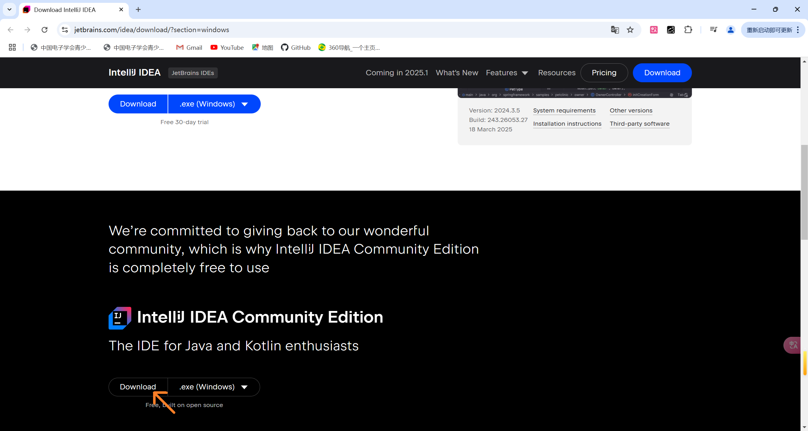
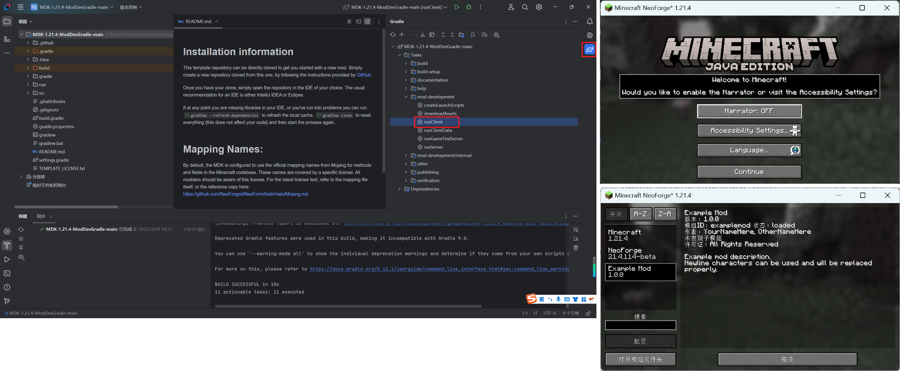

# 开始制作模组&环境配置

## 下载JDK和IntelliJ IDEA

下载[JDK21](https://learn.microsoft.com/en-us/java/openjdk/download#openjdk-21)，按正常步骤安装就可以了。

下载[IntelliJ IDEA](https://www.jetbrains.com/idea/download/?section=windows)，建议下载图中的社区版，因为它免费，专业版也可以。

## 下载MDK

点击[链接](https://github.com/NeoForgeMDKs/MDK-1.21.4-ModDevGradle)，将仓库克隆到本地（若链接打不开或下载速度极慢，文章下方[疑难解答](#1Github链接打不开或下载速度极慢)会给出解决方法）

点击【Code】，【Download Zip】，仓库会下载到本地。然后将压缩包解压缩。

## 用IDEA打开文件

用IDEA打开【MDK-1.21.4-ModDevGradle-main】文件，等待构建完成，可能需要一段时间。点击图中标出的【构建按钮】，可以看到构建任务的状态，如果构建出错，可以按照这一栏中给出的方法解决。

点击右侧标出的按钮，双击【runClient】，IDEA会启动Minecraft，用于测试模组。选择【Language】，然后点击继续（continue），点击【模组列表】，可以看到【Example Mod】是我们现在正在制作的模组。

# 疑难解答

### 1.Github链接打不开或下载速度极慢

[这篇文章](https://github.com/Taigou-1/Blogs-Tech-Tips-Articles/blob/main/Github经常打不开怎么办，教你流畅访问Github.md)提供一个较好的解决方案。或者，网上还有很多类似的视屏或文章，也可以帮到你。
